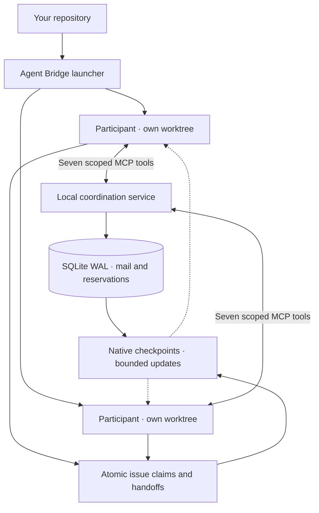

<p align="center">
  
</p>

<p align="center">
  <strong>Separate worktrees. Shared context. One screen.</strong>
</p>

<p align="center">
  Run several coding agents at once and know who owns what.<br>
  Every claim, handoff and refusal is recorded, attributed and visible.
</p>

<p align="center">
  <a href="https://github.com/suneel944/agent-bridge/releases"></a>
  <a href="#install"></a>
  <a href="#install"></a>
  <a href="#providers-and-accounts"></a>
  <a href="LICENSE"></a>
</p>

<p align="center">
  <a href="#see-it">See it</a> ·
  <a href="#install">Install</a> ·
  <a href="#run-it">Run</a> ·
  <a href="#what-it-enforces">Enforce</a> ·
  <a href="#watch-one-provider">Filter</a> ·
  <a href="#providers-and-accounts">Providers</a> ·
  <a href="docs/architecture.md">Docs</a> ·
  <a href="#what-it-does-not-do">Limits</a>
</p>

---

## See it

<p align="center">
  
</p>

Launch a lane, see who owns what, watch every lane at once, narrow to one
provider, and watch a hook refuse a branch switch inside an assigned lane.

<p align="center">
  
</p>

One screen for every lane: session state, branch drift, issues owned, handoffs
pending, unread mail, held reservations, delivered context, and what enforcement
denied. Read-only, no model call, `q` quits.

Every frame on this page is real command output from a demo project. Only the
state and project paths are shortened.

## Install

Linux with pidfd support, Git, and [uv](https://docs.astral.sh/uv/). No clone.
The wheel needs no third-party runtime packages.

```sh
uv tool install git+https://github.com/suneel944/agent-bridge
# once released: uv tool install agent-parley
```

Then add the plugin to whichever CLI you drive. One marketplace serves both.

```sh
claude plugin marketplace add suneel944/agent-bridge
claude plugin install agent-bridge@agent-bridge-local
```

```sh
codex plugin marketplace add suneel944/agent-bridge
codex plugin add agent-bridge@agent-bridge-local
```

The plugin carries the shared `coordinate` skill, so an agent can read bridge
state, claim an issue and hand work off in its own words. It is deliberately
skill-only: the launcher supplies MCP configuration and lifecycle hooks per
session, and it is also what creates the worktrees and runs the coordination
service. The plugin alone gives an agent the skill and nothing to coordinate
through.

For a pinned, checksummed install, take a wheel from
[Releases](https://github.com/suneel944/agent-bridge/releases) instead.

## Run it

From a committed, clean checkout, one terminal per agent:

```sh
# Terminal 1
agent-bridge run claude

# Terminal 2
agent-bridge run codex
```

That is the whole setup. The first run registers the repository, creates that
participant's worktree and branch, starts the coordination service, and hands
you the native CLI. Prompt it exactly as you always do.

A new name creates its own lane, so a second account of the same provider, or
another provider, is one more terminal:

```sh
agent-bridge credentials add account-2 --config-home ~/.claude-account-2
agent-bridge run claude-2 --provider claude --credentials account-2
```

Then watch the work:

```sh
agent-bridge status   # ownership, activity and reported results
agent-bridge top      # every lane live, including what enforcement denied
```

When a lane's work is ready, integrate it from the base checkout:

```sh
agent-bridge participant merge claude-2
```

It always records a merge commit, refuses on a running session, a dirty tree or
a drifted lane, and leaves a conflict in place for you to resolve. It never
resets, cleans, stashes or force-switches.

## What it enforces

**Ownership changes only through explicit claims and accepted handoffs.** No
timeout and no process exit moves an issue. `agent-bridge status` reports who
owns what, which handoff is waiting on an offer ID, and any lane that left its
assigned branch.

<p align="center">
  
</p>

**Native hooks decide before the tool runs.** They block branch changes inside
an assigned lane, catch drift after any bypass, and deliver short updates only
when coordination state actually changes. Each notice is capped at 1,536 UTF-8
bytes; an unchanged checkpoint adds no context at all.

<p align="center">
  
</p>

**Seven scoped MCP tools carry the coordination.** Conflicting reservations
grant nothing and name the blocking owner with that owner's declared reason.
Sends need an idempotency key, so a retry returns the original message instead
of a duplicate. Fetching an inbox never marks a message read.

<p align="center">
  
</p>

Enforcement is recorded, not discarded. Every hook decision carries an
enumerated reason and lands in that participant's event log; every served call
is recorded inside the transaction that carried its effect. That is why `top`
can show what was denied, to whom, and how often.

That history is bounded, and it can leave the state directory. A lane keeps two
event files and discards records older than fourteen days, so `top` reports
recent enforcement rather than the whole project. `--since` narrows any count
to a window, and `events export` writes the retained records as JSON Lines you
can keep for as long as you need:

```sh
agent-bridge top --since 6h
agent-bridge events export --since 7d --output enforcement.jsonl
```

## Watch one provider

With a dozen lanes open, the whole table is rarely what you want. `--provider`
narrows the view to the participants driven by one provider, and the header
counts only the rows it shows:

```sh
agent-bridge top --provider codex
agent-bridge top --provider claude --provider codex
```

## Providers and accounts

A provider states which native CLI drives a participant and how that CLI reaches
a model. Every provider drives one of two adapters, which is why two plugin
installations cover all of them:

| Provider | Native CLI it drives | Plugin that carries `coordinate` |
| --- | --- | --- |
| `claude` | `claude` | Claude Code |
| `codex` | `codex` | Codex |
| `deepseek`, `kimi`, `grok` | `claude` or `codex`, vendor endpoint | that adapter's plugin |
| your own, via `agent-bridge provider add` | the adapter you name | that adapter's plugin |

`claude` and `codex` work out of the box. The `deepseek`, `kimi` and `grok`
presets carry no endpoint, so their base URL and key must be exported in the
launching shell; the launcher refuses to start when a required variable is unset
rather than falling back to another account. Bridge state records variable names
and config directories, never credential values.

Credential profiles point a provider's config-home variable at a separate
directory, so one provider can run under several logins. Up to 32 participants
per project.

## How it fits together



The coordination engine is built in-house with Python's standard library. It has
no runtime dependencies and makes no model calls. Your existing logins and
permission settings still apply.

## What it does not do

Worktrees and reservations are coordination boundaries, not OS sandboxes. Agent
Bridge does not merge branches, approve commands, or wake idle agents. Reported
`ready` is ready for review, not verified completion. Token usage still depends
on the native agents; the bridge reports injected bytes rather than claiming a
token-saving percentage.

## Contributing

Run `make check` before opening a PR. It checks formatting, lint, typing,
documentation rules, package builds, and behavior tests.

[Contributing](CONTRIBUTING.md) · [Architecture](docs/architecture.md) ·
[Operations](docs/operations.md) · [Security](SECURITY.md) ·
[Code of Conduct](CODE_OF_CONDUCT.md) · [MIT license](LICENSE)
