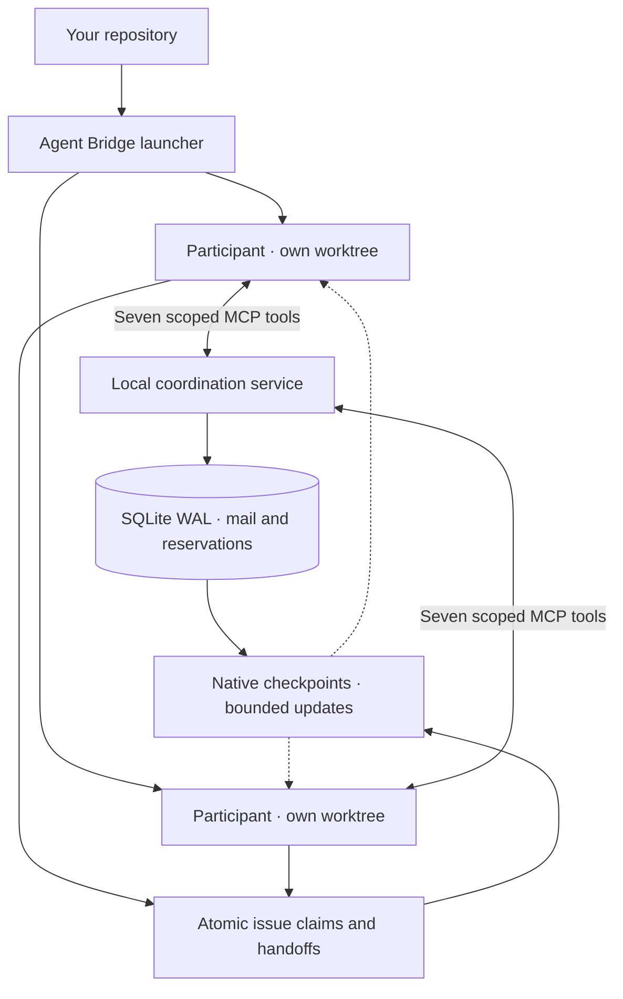

<p align="center">
  
</p>

# Agent Bridge

Work with several coding agents in separate terminals without losing track of
who owns what. Agent Bridge gives each participant a Git worktree and a shared
place for issue claims, file reservations, messages, and handoffs. A project can
hold any mix of providers, and the same provider can appear more than once under
different accounts.

The coordination engine is built in-house with Python's standard library. It
has no runtime dependencies and makes no model calls. Your existing Claude and
Codex logins and permission settings still apply.

<p align="center">
  
</p>

`agent-bridge top` is one screen for every lane: session state, branch drift,
issues owned, handoffs pending, unread mail, held reservations, delivered
context, and what enforcement denied.

Every frame on this page is real command output from a demo project. Only the
state and project paths are shortened.

## Get started

Requires Linux with pidfd support, Git, [uv](https://docs.astral.sh/uv/), and signed-in
`claude` and `codex` commands. Python 3.12+ is installed by uv if needed.

```sh
git clone https://github.com/suneel944/agent-bridge.git
cd agent-bridge
make install
```

Then, from any directory, open one terminal per participant:

```sh
# Terminal 1
agent-bridge run claude --repo /path/to/your/repo --task "Work on issue 42"

# Terminal 2
agent-bridge run codex --repo /path/to/your/repo --task "Work on issue 43"
```

The first argument names the participant. A new name creates its own lane, so
you can add a second account of the same provider, or another provider:

```sh
agent-bridge credentials add account-1 --config-home ~/.claude-account-1
agent-bridge credentials add account-2 --config-home ~/.claude-account-2
agent-bridge run claude-1 --provider claude --credentials account-1 --task "Issue 44"
agent-bridge run claude-2 --provider claude --credentials account-2 --task "Issue 45"
agent-bridge run kimi-1 --provider kimi --task "Issue 46"
```

Define one profile per subscription you own. Any number of accounts of the same
provider can work in one project, up to 32 participants in total.

Providers describe which native CLI to launch and which account it uses.
`claude` and `codex` work out of the box; `deepseek`, `kimi`, and `grok` reuse
those CLIs and need their base URL and key exported in your shell. Define your
own with `agent-bridge provider add`. Bridge state records variable names and
config directories, never credential values.

Start from a committed, clean checkout. The launcher creates each participant's
worktree; the agents claim issues from their assigned lanes. Run
`agent-bridge status` to see ownership, recent activity, and reported results,
or `agent-bridge top` to watch every lane live, including what enforcement
denied.

## How it fits together



## What it enforces

**Ownership changes only through explicit claims and accepted handoffs.** No
timeout and no process exit moves an issue. `agent-bridge status` reports who
owns what, which handoff is waiting on an offer ID, and any lane that has left
its assigned branch.

<p align="center">
  
</p>

**Native hooks decide before the tool runs.** They block branch changes inside
an assigned lane, catch drift after any bypass, and deliver short updates when
coordination state actually changes. Each notice is capped at 1,536 UTF-8
bytes; an unchanged checkpoint adds no context at all.

<p align="center">
  
</p>

**Seven scoped MCP tools carry the coordination.** Conflicting reservations
grant nothing and name the blocking owner with that owner's declared reason.
Sends need an idempotency key, so a retry returns the original message instead
of a duplicate. Fetching an inbox never marks a message read.

<p align="center">
  
</p>

Enforcement is recorded, not discarded. Every hook decision carries an
enumerated reason and is appended to that participant's event log, and every
served coordination call is recorded in the transaction that carried its effect,
so `agent-bridge top` can show what was denied, to whom, and how often.

Worktrees and reservations are coordination boundaries, not OS sandboxes.
Agent Bridge does not merge branches, approve commands, or wake idle agents.
Token usage still depends on the native agents; the bridge reports injected
bytes rather than claiming a universal token-saving percentage.

## Plugins and releases

Claude Code and Codex plugins share the same coordination skill. Installation,
upgrades, and marketplace details are in [Operations](docs/operations.md).
Download packages, plugin bundles, changelogs, and checksums from
[Releases](https://github.com/suneel944/agent-bridge/releases).

## Contributing

Run `make check` before opening a PR. It checks formatting, lint, typing,
documentation rules, package builds, and behavior tests.

See [Contributing](CONTRIBUTING.md), [Architecture](docs/architecture.md),
[Security](SECURITY.md), and the [Code of Conduct](CODE_OF_CONDUCT.md).
Agent Bridge is available under the [MIT license](LICENSE).
