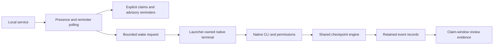

# Architecture and contracts

Agent Parley runs on one Linux or macOS host under one OS user. It coordinates participating
agents; it does not execute model requests, enforce filesystem permissions or
replace native approvals. It integrates a lane's branch only when an operator
runs `participant merge`, and never on an agent's behalf.

## Responsibilities

| Module | Responsibility |
| --- | --- |
| `entry` | Installed command's startup: answers a bare version flag and hands every other invocation to `cli` unchanged |
| `cli` | Worktrees, native launch/configuration, status, reports, merge gates, pull requests and operator mail |
| `server` | Authenticated MCP transport and bounded tool contracts |
| `store` | SQLite schema, migration, scoped mail, atomic leases, the queue waiting on a held key, and tool events |
| `process` | Per-platform process identity, session liveness and shutdown |
| `issues` | Claim and handoff state transitions |
| `lanes` | The one authoritative state record of each lane in the store (`starting`, `working`, `idle`, `blocked` with its cause, `stopped`, `dead`, `reclaimed`), its closed transition table, and the event every accepted or refused transition appends; the per-lane files are evidence it reads, never a second answer. Hooks (`checkpoints.record`) and the dialog watcher submit evidence to a per-project spool (`lane-evidence.jsonl`) instead of waiting on the store; each poll applies it in arrival order before its liveness sample, and keeps it for the next poll when the store is busy. A session change is a transition that records both session ids |
| `roster` | Providers, credential profiles and project participants |
| `retirement` | The withdrawal of one lane at its own request: the work it returns, the worktree it leaves only when Git reports it clean, and the durable retirement mark the supervisor and the operator views read |
| `policy` | Attribution rules shared by the lane hook, integration and the repository gate |
| `forge` | Optional best-effort issue lookups and mirrors on the selected forge: `github` through `gh`, `beads` through `bd`, or `null` |
| `forecast` | Bounded co-change history of the base checkout, cached per base commit, and the advisory collision forecast a reservation or claim carries |
| `recommend` | Ranking of the unclaimed, unblocked issues a lane could take next, from the ledger, the recorded plan, the reservations peers hold and the collision forecast, with the reason for each place; it claims nothing |
| `checkpoints` | Lifecycle observations and bounded context delivery |
| `delivery` | Launcher-owned polling that delivers coordination to a lane whose CLI raises no event able to carry it |
| `hook` | The hook process: one loopback request to the running service for a decision, and the in-process `checkpoints` path when the service cannot answer |
| `gemini` | Lane-private Gemini CLI system settings overlay and translation of its native hook events and results |
| `copilot` | Translation of Copilot CLI's MCP tool names and flat hook result schema |
| `opencode` | Lane-private OpenCode configuration directory, the plugin that runs the hook command for each native plugin event, and translation of those events and results |
| `amp` | Lane-private Amp settings file carrying the MCP server and one `amp.hooks` entry per tool event, and translation of those hook inputs and results |
| `archive` | Consistent export of the store snapshot, ledgers, records and attachments as one validated tar archive without credentials, and its inspection and import |
| `dashboard` | Read-only live operator view and metrics frames of every participant |
| `tables` | Column names, width rule, cell formats and markers shared by `status` and `top` |
| `views` | Machine-readable rendering of read-only command results, as one JSON document or as Prometheus exposition text |
| `metrics` | Durable report records, the peer verdicts recorded beside them, and idle intervals and waiting times derived from retained records |
| `approvals` | Operator decisions bound to one report, commit, target and policy |
| `history` | Read-only ownership history across the ledger, reports and store |
| `watch` | Read-only stream of one lane's coordination events, tailed from the ledger, reports, store and hook event log |
| `retries` | Idempotency key contracts shared by the store and the issue ledger |
| `waits` | Bounded waits for a lane's next mail, served beside the store and woken by a delivery rather than by polling from a turn |
| `plan` | Versioned work-order plans read from TOML and recorded as dependencies |
| `protocol` | Wire-protocol contract between launcher, plugin, hooks and service |
| `records` | Best-effort reading of native CLI session records on disk |
| `completion` | Shell completion scripts generated from the live command parser, and the lock-free candidate lookup they call back into |
| `notify` | Outbound Telegram and SMTP notification of the coordination changes an absent owner needs, selected from decisions the event log already recorded |
| `inbound` | Read-only status queries long-polled from the Telegram bot, admitted by chat identifier and passcode, parsed by the command line's own status filters |
| `state` | Private atomic JSON and text publication and operation locks |

Enforcement and telemetry share one substrate, on purpose, in two places. Hook
decisions are appended per participant beside the lane state, because a hook
blocks its agent and must never wait on the coordination store's write lock.
Served MCP calls are recorded in the store's `events` table inside the very
transaction that carries the call's own effect, so an event exists exactly when
the effect it describes was committed. A rejected call rolls that transaction
back, and read-only queries use a read transaction. Both attempt a separate
write transaction for telemetry and retention with a zero lock wait; a busy
store loses the record rather than delaying the call. This telemetry write
does acquire a write lock when available. Retention is bounded to the most
recent 2000 events per project, and
telemetry never decides an outcome.

The notifier sits downstream of both, and decides nothing. A checkpoint records
its decision in the participant event log first and only then offers it to
`notify`, so a notification can report an outcome but can never change one, and
a notifier failure is discarded exactly as a log failure is. The five changes
that notify are a subset of what the log already holds; the idle stretch is the
one exception, because it has no native event of its own and is measured by the
supervision sweep that already computes it. Suppression follows the checkpoint's
own rule: a digest per event, per lane, in `<participant>-notify.json`, so a
situation that has not changed sends nothing further. Credentials are read from
the environment at send time and never written into coordination state. The send
runs on a daemon thread, so neither a blocking hook nor a supervision sweep waits
on a network round trip; a hook process that exits first abandons the send, which
is the cost of the best-effort contract and the reason there is no retry queue.
Notification is outbound only: no transport carries a command back, and none of
them can answer a native permission prompt.

The one path that carries anything back is `inbound`, and it is limited to
reads. It long-polls the Telegram Bot API from the service process, so it opens
no port and registers no webhook, and it serves exactly one verb: `status`, with
the filters `add_status_filters` declares for the command line and both readers
share. No claim, handoff, wake, permission approval or free text reaches a
session through it, and it writes nothing to coordination state. Admission is
two independent checks, the configured chat identifier and a passcode read from
the environment at service start; only a salted digest of that passcode is held
in memory, it is compared with `hmac.compare_digest`, and it is never written to
state, to the event log or to the service log. A message failing either check is
dropped in silence. Five failures inside ten minutes lock the path for an hour
and emit one outbound notification; the counter and the lock are process memory
and are forgotten on restart. A passcode that is unset or shorter than twelve
characters stops the poller from starting at all and is reported by `status` as
a configuration fault rather than leaving a dead poller behind.

The service is a singleton **per private state directory**. An exclusive startup
lock serializes launch and shutdown; the loopback port prevents a second listener.
Independent state directories remain independent. No global mutable application
singleton is needed. State paths and authenticated actors are explicit inputs,
which keeps transactions testable without HTTP.

Use abstractions for actual boundaries. Do not add factories, interfaces, or
inheritance solely to name a pattern. The HTTP server implements its standard-
library base contracts; the type gate checks method overrides.

Three entry paths pay an import price on every invocation, and each one loads
only what its work needs. The lifecycle hook runs once per native tool call and
imports the request's own modules alone, reaching the checkpoint engine only on
the fallback path. The installed command starts in `entry`, which imports the
package marker: a bare `--version` or `-V` answers from that marker, and
anything else, including a version flag mixed with other arguments, is handed
to `cli` so argparse produces the parsing, error text and exit status. The
package binds `cli` itself the same way, so importing the surface does not
execute it. `cli` binds command modules, selected standard-library modules and
its legacy direct-name callables through deferred modules, so a command loads
only the modules it reaches. Plain, unfiltered status skips parser construction,
reads an existing configuration without taking its creation lock and sends one
bounded HTTP request on a loopback socket rather than loading the general URL
opener.

The startup budgets are under 20 ms for a bare version, under 50 ms for status
and under 15 ms for importing `agent_parley.cli`. `scripts/benchmark.py`
records medians of 15 isolated `python -S -P` processes and reports any budget
miss beside the interpreter floor. Raw wall time depends on the host, so a host
whose interpreter floor approaches a budget cannot validate that absolute
number; before and after readings must use the same interpreter and machine.
Import boundaries are asserted in `tests/test_startup_imports.py` and
`tests/test_hook_client.py`.

## Authentication and protocol

The launcher registers lanes locally. Registration is not exposed over MCP.
A bearer token identifies exactly one project and agent. The database stores its
SHA-256 digest; private identity files retain the credential for restart. Tool
arguments cannot select another project or impersonate an agent. A separate
health token grants no tool access. Credentials travel through the native
client's environment, never the model prompt.

`AGENT_PARLEY_TOKEN` is inherited by every child of the native client, including
shell tools, Git hooks and test runners. Those processes can authenticate as
that lane; this is not an isolation boundary against code executed by the agent.
Run untrusted programs with `env -u AGENT_PARLEY_TOKEN COMMAND` and keep native
approvals enabled. That removes inheritance for that process, but does not
isolate a process running as the same OS user from private identity files.
Separate OS users or containers are needed for mutually untrusted workloads.
The token is scoped to one lane and project; it grants no operator identity.

Inbox reads return `read_ts` and `ack_ts` without changing either. `unread`
selects receipts without a read timestamp; `unacknowledged` selects messages
that require acknowledgement and lack its timestamp. Combined filters select
their intersection and preserve `after_id` paging. All body offsets are
validated even when no row is returned. Inbox, thread, search and reservation
responses use the same `MAX_RESULT_BYTES` budget.

Every message carries the claim its sender held when it was written. When that
claim closes, moves to another lane or completes, each delivery of its mail that
is still unread or still owes an acknowledgement is marked superseded with the
reason, and the sender stops expecting an answer to it. Receipts are never
forged: `read_ts` and `ack_ts` keep the empty values they had. Superseded mail
is excluded from checkpoint previews, mailbox counts and the stall reading, and
is reported separately as a count, so a lane woken after days asleep is handed
the threads that are still live rather than every message it ever received. The
wake backlog is a bounded digest of the newest message per live thread, capped
at `WAKE_DIGEST_THREADS`, because the checkpoint context a woken turn receives
is itself bounded by `MAX_CONTEXT_BYTES` and previews at most three messages.

Pending coordination is context, never a refusal. A checkpoint hands unread
mail, owed acknowledgements and project news to the turn as additional context
and lets the tool call run; `Stop` blocks only for an issue or work notice. A
tool call is denied only when it is unsafe now: a write to a path a peer holds
under an exclusive reservation, or any non-read-only call while an offer to
this lane expires within `OFFER_REPLY_SECONDS`. The denial names the path and
holder, or the exact accept and decline commands. Read-only and diagnostic
tools are never refused. Mail a checkpoint previewed is marked read.

A message carries a `topic`, `direct` unless the sender names one. A newer
message from the same sender on the same topic supersedes the recipient's
unread copy of the older one. The `base` topic, which a subject such as
`Merged #12` or `main is at abc123` selects, is project news: it goes to a
feed each lane reads once at session start and in its advance notice, and to
no mailbox. A broadcast, a send to every other live lane with at least
`BROADCAST_MIN` recipients, reaches only the lanes it concerns: an
acknowledgement request, a mention of the lane, or a reservation or claimed
work the text touches. The rest are reported as `withheld` and read it in the
feed. A send to a chosen subset is delivered to everyone it names. The preview
digest orders mail by that relevance and states how many unread and
superseded messages it left out.

The supervising operator writes from the command line only. `agent-parley say`
resolves the project and the addressed participant, then takes the ordinary
send path, so the message is deduplicated by its key, can require an
acknowledgement, and is read back beside peer traffic. Its sender row is created
on first use and never carries a credential digest, so no bearer token resolves
to it and no served session can write in its name. The name `operator` is
reserved, so no participant, provider or credential profile can claim it. No
tool is added for this: the served surface stays the fourteen tools below.
`agent-parley decide` records a decision on the same path and addresses no
inbox, and `agent-parley decision list` reads the log back.

The server binds `127.0.0.1`, checks Host and Origin, rejects unauthenticated
requests, and avoids credential/body logging. It supports stateless JSON responses
over MCP Streamable HTTP, not SSE sessions or remote hosting. The independent
official MCP SDK exercises initialization and calls in CI.

Fourteen tools cover sending, fetching, waiting for mail, acknowledging,
marking read, reserving files, queueing a request for a key a peer holds,
cancelling that request, releasing reservations, listing participants, reading
one thread, searching mail, searching decisions and recommending the next
issue. Paging an attachment is served on the same authenticated path. Unknown
arguments fail. A body
above its cap is spilled whole to `attachments/` under the project state
directory by `agent_parley/attachments.py`, keyed by an opaque
`kind-identifier` reference that is validated by pattern and resolved only
inside that folder; the record keeps a bounded slice ending with the
reference, and `read_attachment` serves it only to its writer and its
addressees. Sends require an idempotency
key: identical retries return the original message ID; changed retries fail.
Fetching never marks a message read or acknowledges it.

Every delivered message belongs to exactly one thread. A send naming
`reply_to` joins the thread of the message it answers, and that message must
be one the sender itself sent or received. A send naming neither `reply_to`
nor `thread_id` opens its own thread, whose identifier is derived from the
sender and the idempotency key rather than allocated, so an interrupted send
that retries resolves the same thread instead of opening a second one. A
thread link is a resolution rule, not a stored parent pointer: threads are
read in send order, so no reply tree is recorded. An inbox page names each
message's thread, so a recipient can read or answer into it without a further
call. Reading a thread and
searching mail are scoped to what the caller already sees, so neither widens
a lane's view of the project. Their queries take no write lock; served MCP
reads then attempt the nonwaiting telemetry write described above. Operator
thread and search commands record no tool event and take no write lock.

A send marked `decision` is additionally recorded in the project's decision
log. The mark is a column on the message rather than a second substrate, so a
decision is deduplicated, threaded, bounded and spilled to an attachment by
exactly the rules that govern mail, and `search_decisions` reads it back for
every registered participant of the project, sender and recipient or not. Only
that mark widens a scope: unmarked mail keeps the sender-and-recipients scope
described above, and the upgrade that adds the column marks every stored
message as ordinary. A decision may address no recipient, which records it
without putting it in an inbox; an attachment a decision spills stays readable
by its writer and its addressees alone, so the log reveals the bounded record
and never more than the message did.

The addressable roster omits the operator and revoked credentials before
applying its 32-participant limit. Sending to either is refused with an
explanation; retained mail remains available to a re-registered participant.

No coordination tool returns a participant's whole starting context. The store
holds projects, agents, messages, recipients, reservations, the requests queued
for them, and events, keyed by
an authenticated project and lane. The issue ledger and the participant
manifest are files in the project state directory, whose name derives from the
repository's Git common directory, which the store never records. A served
call carries no repository path. The supervision worker separately discovers
private project manifests for presence, reminders and wake requests; the served
tool handlers do not run Git. Dependency edges live in the same ledger file for
the same reason: `issues.json` already records ownership, offers and history
per issue, and the checkpoint that reports a revision change reports the edges
with it, so dependency notification costs no new substrate and no new tool.
Checkpoints already deliver the roster, the issue
ledger and message previews at session start and again on any prompt submit or
pre-tool-use whose state changed; `list_participants` returns the roster on
demand; and `agent-parley issue list`, run from a participant's own worktree,
re-reads the ledger from the one process that can resolve the directory. The
store therefore stays free of repository paths, and refreshing context stays a
checkpoint and CLI concern rather than a coordination tool.

## Participants, providers and accounts

`supervision.py` owns the service's periodic presence observations, advisory
handoff reminders, bounded wake requests, and the capacity check that decides
whether a lane could take more work. Each check is provider specific with a
null default: the session process from the activity file, a recorded usage
refusal from `records.py`, the worktree from Git, and owed acknowledgements
from the store. The result and any work offer are published per lane as
`<participant>-work.json` beside the other lane state, because the offer is
about a lane rather than an issue and the ledger records only ownership. The
checkpoint injects an offer once per identifier and `top` reads the same file,
so the operator sees exactly what the runtime asked. The publication also keeps
a dispatch generation, issue-scoped progress digest, bounded attempt count and
last result. An unchanged actionable offer joins the wake backlog even after a
checkpoint injected it. The launcher reads the revalidated wake selection from
private state after admitting the wake, so generated work context does not
cross the wake socket. The attempt bound measures lane progress rather than
elapsed wakes: each attempt records the lane's own progress marker, built from
its HEAD movements, the state of the claims it owns and its latest reservation.
Hook events and turn ends do not count, because a woken lane that reads its
prompt and stops records both without doing anything. Three attempts across
which that marker never changes produce one durable escalation in the same
publication and in `top`; waking then backs off by doubling to an hourly
ceiling instead of repeating every window or stopping. Any progress resets the
series and clears the escalation, and changed issue state starts a new bounded
attempt series. A spent attempt is re-decided on every poll rather than being
final: durable capacity, the published screen state and the recorded session
process are read again, and a cause still in force parks the lane with that
cause and the time its next attempt is due without spending one, so nothing is
consumed while nothing could answer. A screen-state label blocks only while
the presence reading is current; a label older than the inactivity window was
left by a dropped hook and no longer blocks, except an approval prompt, which
records no hook until answered. An exhaustion that named no reset is probed on
the same doubling backoff, and an accepted probe or a later tool hook clears
it. A cleared cause makes the next attempt due one doubling inactivity window
after the last, or at the provider reset the capacity observation named,
whichever is later. `status` prints that next time, and prints the exhausted
budget with its last cause and the backoff for a lane that spent every
attempt. Each poll stage runs isolated: a failing stage is recorded in
`supervision-error.json` and `server.log`, reported by `status` and `problems`,
and the remaining stages still run; a clean poll clears the record. Every
exception is caught, each lane's wake is its own stage, and the record names
the stage, the lane and the line that raised; the supervision thread itself
catches every exception a poll raises, so one malformed record can no longer
end supervision for the service. The poll's presence write waits the store's
busy timeout like every other writer. Each poll writes
`supervision-poll.json` with the wall time of each stage, and `status` prints
its age, its wall time, its slowest stage and the age of the last clean poll.
Each lane's fitness and idle readings are taken once per poll and shared by
every lane's backlog, so a poll's Git and capacity readings grow with the lane
count, not its square. A branch's pull-request completion is read from the
forge at most once a minute per branch, so a merge is noticed up to a minute
later. An offer is
advisory: it never writes the ledger,
and `issue offer` remains the only transfer path. Supervision reads project
manifests to resolve lane state; this is the explicit bridge from served
project identity to private launcher state. Its best-effort forge reads run
outside store write transactions, and observation failures do not fail a
committed coordination call. `participant_presence` is an additive table
initialized with the store. The issue ledger retains reminders; only explicit
issue transitions own claims.

`reclaim.py` decides which lane worktrees and branches a project may remove
and holds no removal of its own. It reads Git in the base checkout and in each
lane and the forge through `forge.py`, and returns one assessment per lane
naming the single condition that decided it. Removal stays in `cli.py`, where
it is the ordinary retirement followed by Git's own merged-branch deletion, so
a reclaimed lane leaves the state a retired lane leaves. `supervision.py` runs
that sweep from a poll no more than once every fifteen minutes and publishes
its outcome as `reclaim.json` beside the other project state, which bounds the
next attempt whatever the last one did. The split keeps the decision testable
without deleting anything and keeps every deletion on one path.

Provider capacity is durable per lane and records available, exhausted,
retryable and unknown states with the native evidence and session identity.
Elapsed supervision time never restores capacity. A validated later response,
a structured provider reset or a recorded bounded probe does. Refusal text is
read by the strength of its evidence: a named account, quota or session limit
first, then a named throttle, then a bare `limit reached`, then an overload
report or a bare status report such as `API Error: 529` or `HTTP 429` next to
an explicit API, HTTP or status label. The named limit accepts at most two
words between the possessive and `limit`, so a session or weekly limit is
recognised and stays exhausted even when the same text carries throttle
wording or a status number, while `Rate limit reached for a model` stays
retryable because the named throttle is read before the weaker wording.
Text that names the clock time and zone its limit resets, as in
`resets 3:30am (Asia/Dubai)`, carries that instant as the observation's reset,
which the existing reset handling holds the lane to and clears on. A retryable
block makes the lane unfit, so no work or share is offered to it, and it is a
wake backlog reason keyed by its observation, so the resume runs on the bounded
wake backoff rather than on the inactivity budget. Exhaustion is
shared across lanes only when an explicit credential profile identifies the
same provider account. An exhausted owner's unfinished claims remain visible
as recovery candidates even when it owns only one claim or no eligible peer is
currently available. A candidate is evidence for a recovery decision; it does
not transfer ownership or establish that a live owner stopped editing.
The supervisor atomically replaces `capacity-candidates.json` with the current
candidate snapshot. An empty snapshot clears stale candidates. Recovery reads
the persisted issue candidate and revalidates its owner and evidence identity
before acting.

The same poll marks the claims of a lane whose session process is gone, or
whose last event was a clean `SessionEnd` with no process left to check, and
that has been silent past the stall threshold, writing an orphan marker on each of
its ledger records and sending every other lane one notice that names those
issues and the reservations the dead lane still holds. The marker is an
observation: the issue keeps its owner and the reservations keep their holder
until a peer records `issue claim --take-orphaned`, which writes a `take`
transition naming the previous owner and the reason and then releases that
owner's advisory reservations through `store.py`. The same poll withdraws a
marker whose owner's recorded session process is alive again, under the same
`issues.lock` and with one notice to the peers that received the orphan notice,
so a stored observation never contradicts what takeover reads. A marker
carrying an operator authorization and a checkpoint describes an approved
quiesce and survives that pass.

The same poll delivers the operator items recorded in `scheduled_deliveries`,
an additive table whose rows carry a not-before instant, a condition and a
bounded repeat. Recording an item and delivering it are separate: `store.py`
owns the rows and performs the send, the delivery record and the enrollment of
the next occurrence in one write transaction, and `supervision.py` decides only
whether a trigger has arrived. Conditions are answered from recorded ledger
transitions, never from branch or pull request inference, and no read-only path
delivers. There is no scheduler process and no additional thread.

`terminal.py` owns a native pseudo-terminal and a private control socket under
the existing session lock. It reaps the client itself, ends the session on
`SIGTERM` or `SIGHUP` through its normal cleanup, bounds a detached launcher's
output log, and rewrites the titles the client sets into a lane-first tab title
read from the activity record and the issue ledger. Because it owns that stream, it is also the only
place that can see a dialog the client draws on its own screen, so it passes
every chunk it forwards to `dialogs.py`. That module recognizes the screens
recorded from live clients, records an exhausted provider capacity with the
reset instant a usage limit names, sends the option the operator configured for
an answerable prompt, and escalates anything else that holds the screen. It
publishes through the lane surfaces a reader already has: the activity record
gains a `dialog` entry and its `activity` string is prefixed `dialog: `, so
status reports the dialog instead of `working` or `starting`. It sends the
keystrokes an operator would press and never a flag that skips a permission
decision. A permission prompt reaches `checkpoints.py` as well, because the
client runs its `PermissionRequest` hook while it waits; that branch publishes
the same `dialog` record, naming the tool and the instant the wait began, so
status, the fit checks, wake admission and `problems.py` read one surface for
both observations. `dialogs.py` also owns the operator opt-in the launch reads
before it carries approval of this bridge's own MCP server and its own CLI
command into a client's native permission settings, which is off by default
and scoped to that server and the one interpreter and module
`protocol.cli_command` spells for the prompt, the rule and the watcher alike.
With the opt-in on, the watcher answers a shell prompt for that command and
nothing else. `gemini.py`, `copilot.py`, `opencode.py` and
`amp.py` translate the additional native hook contracts. `evidence.py` collects retained claim-window measurements and writes
review artifacts beside the lane. The CLI orchestrates these modules and runs
configured verification before publishing a PR; native authentication stays in
the launch and forge paths.

A project holds a roster of participants. A participant is one lane: its own
worktree, bridge branch, registration credential, activity file, event log and
session lock. Its name addresses it in handoffs and message recipients, and it
also becomes a directory and a branch component, so the validator accepts only
lowercase letters, digits, hyphens and underscores. Dots are refused: a lane
named after a peer's state file would otherwise shadow that file. Adding a
participant creates only that lane and never touches existing lanes or branches.

A lane leaves the project by retiring itself through the `retire` tool, and the
order of that withdrawal is what keeps nothing stranded when a later step fails.
The work leaves first: every issue it holds is released back to the pool and
every handoff offered to it is declined, because an offer returned to its sender
would park ownership on a lane that can no longer answer. The sender is told by
mail instead. The worktree leaves next, and only when Git reports it clean; a
lane with uncommitted changes keeps its worktree and reports the paths, and a
checkout Git cannot inspect is treated the same way. The manifest mark is then
written, which is what makes the retirement durable, and one store transaction
finally releases the advisory reservations, grants any key a peer was queued
for, sends the notices and invalidates the credential. The participant stays in
the roster carrying the time it retired, so `status` and `top` report it as
retired rather than stalled, the supervisor never wakes it, never measures it
and never names it as a peer work could move to, and the operator returns it to
service with the same `participant add` command that created it.

The activity file holds last state only; the event log,
`<participant>-events.jsonl`, appends one record per observed hook event with an
enumerated reason class and the decision it produced, so denials are retained
rather than overwritten. Hooks block the agent, so the log stays a plain
append-only file in the project state directory, outside the coordination store
and its write lock, and it rotates to `<participant>-events.1.jsonl` at a fixed
byte cap. A reader summarizes the rotated file and then the current one, oldest
record first, so a report covers everything still retained rather than the
current file alone. Retention is bounded twice: two files, because the rotation
that creates a new one discards the older, and a maximum record age. Age
retention rewrites the log, which costs a full read and write, so it runs only
at a session boundary and never on the blocking path a hook takes before a tool
call. A lane that never reaches a session boundary is still bounded by the byte
cap. Each file is replaced atomically, and a failed rewrite leaves the log
exactly as it was. A log failure never changes an enforcement outcome.

Event-file lifetime has its own kernel lock, separate from the store and
checkpoint locks. Append writers hold shared access; rotation and prune hold
exclusive access, rechecking the byte cap after acquisition. Writers therefore
do not serialize one another, but they wait for maintenance rather than append
to a replaced inode. Locking maintenance alone cannot prevent that lost-write
race. Interrupted prune temporaries are removed on the next prune.

Retained records are readable as a whole or over a window. A window filters on
the recorded time, so it reports a period rather than a file, and a record
carrying no time is never counted inside one. Export writes the retained
records as JSON Lines, one record per line, each naming the participant that
produced it, so enforcement history leaves the state directory in the shape it
was stored in rather than a rendered summary.

A lane's session state follows a recorded session process identity, matched by
process ID and the creation time the kernel recorded for it, never its session
lock. The managed launcher records its child directly. Generated hooks can also
derive the native foreground process group from their controlling terminal;
hook payloads cannot assert that identity. A provider that starts its hooks
without a controlling terminal leaves that reading empty, so a hook whose
terminal names nothing is instead traced up a bounded ancestry to the client
the recorded launcher started, after the launcher's own creation identity is
rechecked. When neither source is available, presence is unknown and automatic
resume is refused. The launcher holds the
session lock for the whole session, so probing it would make a concurrent launch
fail while merely reporting. A session whose recorded process is gone reads as
stopped.

Linux shutdown pins the process with pidfd before checking its creation time
and signaling it. When a Python build omits `os.pidfd_open` or
`signal.pidfd_send_signal`, stdlib `ctypes` calls the host libc's matching API.
A host lacking that API fails closed; it never falls back to signaling an
unpinned numeric PID.

A provider states which native CLI drives a participant and how that CLI reaches
a model. Coordination needs an MCP server, a system prompt and lifecycle hooks,
and five contracts implement that, so every provider names one of the five
adapters and its executable must accept that contract in full. `claude` and
`codex` take all three as command-line arguments of the session the launcher
starts, so nothing is written into a configuration file the operator also owns
and no state survives the session. `copilot` is file-configured: Copilot CLI
reads MCP servers and hooks from its configuration directory, so the launcher
writes the `agent_parley` MCP entry and appends its hooks while preserving other
servers, hooks and settings in `mcp-config.json` and `settings.json` in the directory
`COPILOT_HOME` names. That directory also holds the client's own credentials
and its user-level hooks apply to every session started from it, so a `copilot`
participant requires a credential profile and the launcher refuses without one
rather than placing lane hooks in the operator's own configuration directory.

Providers for other vendors reuse an adapter and change the endpoint through
environment variables, so a preset names the vendor whose models answer rather
than that vendor's own agent CLI. The `deepseek`, `kimi` and `grok` presets carry no endpoint;
`agent-parley provider add` defines further providers locally.

Gemini CLI uses a lane-private system settings overlay that preserves native
system policy, with translated hook input and output in `gemini.py`. OpenCode
extends sessions through JavaScript plugins rather than hook commands, so
`opencode.py` copies the user's configuration directory into a lane-private
one, adds the MCP server, and writes one plugin that spawns the configured
hook command for each native plugin event; its results are translated back
into the plugin's fields. Both overlays live under the private state root,
are rebuilt from the native source on every launch, so a crashed or edited
overlay never carries into the next session, and are removed by
`participant retire`, which also strips a retired `copilot` lane's hooks from
its profile directory. No adapter shares a settings-file abstraction because
no two of these CLIs share a stable file contract. Each adapter declares the
lifecycle events its CLI cannot raise; `provider list` reports them as
`unavailable_hooks`, and the launcher refuses an adapter that lacks a required
guard rather than claiming enforcement. `amp.py` copies Amp's settings file
into a lane-private one with the MCP server and one `amp.hooks` entry per tool
event, and translates those inputs and results; Amp raises no thread start or
idle event, so `SessionStart` and `Stop` are unavailable and the launcher
refuses an `amp` lane today. `docs/operations.md` records that surface and
what only a live trial can verify.

An adapter whose CLI raises no event able to carry context is served by
`delivery.py` instead, which `provider list` reports as the `polled` delivery
path against the `hooks` one. It is launcher-owned, never a served path: the
launcher starts one daemon thread for the life of that native session, and
the thread reads the same mailbox `checkpoints.mailbox` reads, composes the
same bounded notice the checkpoint composes, publishes it to a lane-private
file under the state root that the coordination prompt tells the lane to read
each turn, and records the delivery through `checkpoints.record` so a polled
lane's delivered context is counted where every other lane's is. The feed,
owed-acknowledgement and relevance-ordered mail digest come from the same
`checkpoints` builders, and the mail it previews is marked read as a hook
delivery marks it. A read that
fails is retried on the next interval rather than raised, because losing
delivery must never end a native session, and delivery decides nothing: a
missing guard still refuses the launch.

A credential profile selects one account by pointing the CLI's config-home
variable at a separate directory, so the same provider can run twice under
different logins. Profiles record directories, plain variable values and required
variable names. Values whose names look like credentials are rejected, and
required variables are read from the caller's environment at launch, so no
credential value enters bridge state. Sign-in inside each config home remains the
native CLI's own action.

Registering a project reads committed HEAD, so pending base-checkout work would
never reach a lane. Rather than refusing, `setup`, `participant add` and `run`
stash that work with `git stash push --include-untracked` when they create the
project manifest, then report the entry on standard error. One stash stack is
shared by every worktree of a repository, so the entry carries a unique message
and is restored by name with `git stash apply <entry>` rather than by position.
Nothing is reset, cleaned or force-switched, and a checkout Git cannot fully
stash still refuses. Later registrations read the existing manifest and never
touch the checkout.

`verify show` only reads an existing manifest, without taking a setup lock or
creating project state. `verify set`, `participant retire`, and
`participant merge` also require an existing manifest. An unregistered
repository receives setup guidance even when it has pending work.

Branch verification is scoped to the lane an operation touches, so a lane left
on the wrong branch blocks only its own participant. `status` reports the actual
branch when it differs from the assigned branch. `participant restore` returns
one lane to its branch and `participant retire` removes one lane; both refuse
while that participant holds
its session lock or its worktree is dirty, and neither resets, cleans, stashes,
or force-switches. Retiring invalidates that participant's credential and keeps
its branch whenever the branch holds commits the project base does not.
Retiring removes identity, activity, MCP configuration, both event logs,
temporary event files, and the participant's checkpoint and session lock
files. Mail stays in the store. If the branch is kept, the response names the
rename command and requires an unused destination before that name is added
again, so a new lane does not inherit old hook totals.

`participant merge` integrates one lane's branch into the base checkout. It runs
in the common repository root, never inside another lane, and always records a
merge commit, so an integration is auditable rather than replayed as a fast
forward. It refuses on a drifted lane, on a running session, on a dirty base
checkout, on uncommitted lane changes the branch does not carry, and on a base
checkout that is already merging or on a detached HEAD. A conflict is left in
the working tree with the conflicting paths named and both `git merge --continue`
and `git merge --abort` reported; Agent Parley never resolves a conflict, and
never resets, cleans, stashes or force-switches. Merging leaves the lane and its
branch untouched, so retiring stays a separate decision.

`participant merge --preview` answers the same question without acting. It
reports the commits `HEAD..branch`, the files they change relative to the merge
base, and every refusal above at once instead of one at a time, so a single
report names everything to fix. Merge and preview share one generator of
refusal conditions, so their wording cannot drift; the merge raises the first
condition it meets, the preview collects them all. The preview writes nothing
and takes no session lock, because previewing a lane while its agent works is
the ordinary case and that lock belongs to the session; a running session is
read from the recorded session process, as liveness reporting reads it. It
performs no trial merge, so it reports refusals, never conflicts. The preview
reads Git state only and never runs the verification command below, because
executing a configured command is not a read.

A repository can require one verification command to pass before any merge.
Executing a configured command is a different trust decision from reading Git
state, so the gate is a separate step at the merge entry point rather than one
more Git refusal, and `agent-parley verify` is the only thing that records it.
It lives in that repository's project manifest, beside the roster and the
project base, because the manifest is already the per-repository configuration
and it already sits outside the target source tree; no new file and no
in-repository file is introduced. A repository with no command configured runs
no gate and merges exactly as before. The command is stored as argument tokens
and run without a shell, so redirection, expansion and chaining cannot ride
into a gate, and it runs in the common repository root while the merge already
holds the project setup lock and that participant's session lock, so the lane
cannot start and the roster cannot change underneath it. A non-zero exit
refuses the merge, reporting the exit status and the last twenty lines of the
command's combined output; a command that cannot run is a refusal, not a skip.
No flag bypasses the gate, and removing it is an explicit `verify set ''`.
The gate reports the base checkout as it stands before the merge, which is not
a claim about the merged result, so combined post-merge verification remains a
separate reviewed action.

`participant pr` pushes one lane's branch to `origin` and opens a pull request
carrying that lane's recorded report. It is the only command that writes to the
repository's remote; the forge mirrors above touch issues, never Git, and
reading status stays local. It reads the report from lane activity, the claimed
issues from the issue
ledger, the title from the first commit the lane added, and the base from the
branch the common repository root has checked out. Authentication is the native
`gh` CLI's own, so repository permissions and rules apply unchanged and no token
enters bridge state. The generated body carries the three headings of
`.github/PULL_REQUEST_TEMPLATE.md` and an explicit reference to every claimed
issue, which is what the repository's pull-request hygiene gate requires of a
body. The assignee is the operator's own forge account, and the change-type
labels and milestone are mirrored from the claimed issues, so classification
comes from the issue rather than from the lane and the hygiene gate passes at
creation. That metadata resolves before the push, so a refusal leaves no remote
branch behind. It refuses on an unknown participant, a missing report, an
claimed issue rejected by the configured metadata policy, an
unclaimed lane,
a branch that adds no commits to the project base, and a base checkout on a
detached HEAD or on the lane's own branch. An open pull request for the branch
is reported instead of replaced by a second one.

The command excludes a live lane launch through that lane's session lock. A
project whose manifest sets `pull_request.self_service` also admits the lane
itself, run from its own worktree for its own name, under a separate
integration lock rather than that session lock, because there the live session
is the caller. The manifest is the only place the authorization lives, it is
off unless written, and the admitted path evaluates the repository's conditions
before anything is pushed: a `ready` report in lane activity, a configured
verification command, the assigned branch still checked out in the lane, and no
peer entry in the store's active reservations overlapping the paths the branch
changed. The conditions travel with the evidence record and the integration
record, so a self-opened pull request states what authorized it. `participant
merge` takes no such policy and stays an operator command.

Manifests written by the earlier two-lane layout upgrade on first read. Migrated
lanes keep their branches and registered identities, so existing mail, claims and
reservations continue to resolve.

## Persistence and concurrency

Mail uses SQLite WAL with indexed inbox and held-lease queries. Each write
acquires an immediate transaction, validates and mutates, then commits once.
Connections close after every operation. A writer waits up to five seconds for
another transaction to commit.
Conflicting reservation batches grant no paths. Each conflict names the blocking
lane and that lane's declared reason, clipped to 80 characters, so a denied
caller can judge the overlap without a further call. Conflicts are reported
until the serialized result reaches its budget, and `has_more` states that
further conflicts exist beyond the reported ones. Every lease records its
creation time, so an operator can see lease age rather than expiry alone.
Directory overlaps are detected;
two globs conservatively conflict when either lease is exclusive. Use exact paths
when disjoint globs would otherwise be rejected. Renewals replace the owner's
previous lease atomically. Released leases no longer block work.

`ttl_seconds` is optional. A lease taken without one carries no deadline and
never reports as stale. A lease taken with one reports as stale once its
deadline passes: the conflict it raises carries `stale`, `agent-parley top`
marks the count with `!`, `agent-parley status` counts the expired leases apart
from the live ones and names the age of the oldest, and both surfaces report
that age in seconds past the deadline.

An expired lease is renewed by its holder or reclaimed from it. A holder that
is still working renews its own expired leases at its next `PreToolUse`,
restoring the window that holder declared, so live work never loses a key it
is using. A session start, a prompt, a turn end or a supervisor resume proves
no work and renews nothing. A lease correlated with a claim that holder no
longer holds is released at that checkpoint instead, and the holder is told
which keys it lost. A lease whose holder was last observed without a live
session process, or idle past the project's inactive threshold, or that has
been expired longer than the `RESERVATION_GRACE` window of 1800 seconds,
is released by the next reservation call or supervision poll: the oldest queued
request for each key is granted, the lane that took it is told who lost it, and
the former holder is told what was released and why. The grace sits above the
whole wake budget, so a holder that can be woken is woken and renews before any
peer takes its key. Reclaiming stays advisory: it changes who is told that a
key is free, never what the file system allows, and nothing on disk is locked
or reverted.

`request_reservation` takes the same batch as `file_reservation_paths`. Where
nothing conflicts it grants exactly the same leases, so a lane never has to ask
twice. Where a peer holds a key it grants nothing and records one queued
request per blocked key, and the refusal names the holder and the place in that
key's queue beside the usual conflict. Asking again for a key already queued
keeps the first request and its place. When the holder calls
`release_file_reservations`, the release, the grant to the first queued lane
and the one notice naming the granted keys are a single SQLite transaction, so
no reader observes a released key with its queue untouched and no lane is told
it holds a key it does not. A key another lane still holds stays queued. A
queued request reserves nothing: it blocks no peer, holds no path and locks
nothing on disk. `cancel_reservation_request` withdraws one request or every
request of the calling lane, and revoking a lane's registration expires its
queued requests in the same transaction, because a lane that can no longer be
addressed can neither take a key nor be told that it did. `agent-parley status`
names the requests queued on a lane's keys and who asked; `agent-parley top`
marks the count with `+` in the `LEASES` column.
No time-to-live applies to issue ownership, which changes hands only through
release, or an explicit offer and acceptance.

Three versions move independently: the installed package, the wire protocol a
hook or a served call speaks, and the store schema on disk. They are separate
because several package versions normally share one protocol, so equal package
versions are not the only compatible combination. Each boundary states its
number and compares it where the call already crosses. The launcher compares the
installed plugin's declared protocol before it starts a lane and refuses with
both numbers and the one command that updates it. The launcher writes its own
protocol into the hook command it configures, so a hook validates locally and
never reaches the network to learn a version. A served call declares its
protocol in the `Agent-Parley-Protocol` header, and an unaccepted one is denied
by name and counted where every other denial is counted; a call that declares
nothing is served, because the header was added after the first protocol.
`store.initialize` still refuses a newer schema and `roster.normalize` still
refuses a newer manifest; neither is replaced by a weaker check and neither
migrates downwards. `agent-parley doctor` reports all three, and the build the
running service is serving as its `service` component, and exits non-zero
on a mismatch without opening a lane, writing configuration, or printing a
credential.

A work-order plan is one TOML file the operator writes, parsed by the standard
library. Applying it records the same advisory dependency edges `issue block`
records and nothing else: no claim, no assignment, no gate. Each apply records a
version carrying the file's digest and the identity that applied it, bounded to
the twenty most recent versions in `plan.json` beside the issue ledger. A plan
is refused before any edge is written when it names a malformed issue, exceeds a
bound, or describes a cycle, so an operator never has to unpick a half-applied
order by hand. The cycle check reads the recorded edges too, so plans applied
in turn cannot close a cycle together, and an edge to a complete issue is
skipped. Each supervisor poll drops an edge whose blocker is complete or no
longer recorded, because completion reconciles dependents only once, at the
instant it is recorded. Applying adds edges and never removes one, so an edge recorded
after the apply is reported as entered by hand and a narrowed plan shows its
dropped edges as unlisted until `issue unblock` removes them. Groups are advice
a later offer or integration path may read; this layer only records them.

A writing call can commit and still fail to answer, so the caller retries what
already happened. An idempotency key makes the two calls one. The first call
carrying a key performs the effect and records the key, the digest of the
arguments that defined it, and the result it returned. A later call from the
same participant carrying the same key performs nothing further and returns the
first result, marked `replayed`. A key repeated with different arguments is
refused by name, so a stale retry cannot land on a different issue, path or
recipient. Keys are scoped to one participant and one operation, and they are
retained per participant to the most recent 500 calls; a key discarded past
that window behaves as a first call.

Each substrate keeps its own keys, because a record in one cannot make a
mutation in another atomic. Served calls record the key in the `idempotent_calls`
table inside the transaction that carries the effect, and issue transitions and
reports record it in the same locked JSON write as the record they change. An
interruption therefore cannot leave a key without its effect.

A refusal changed nothing, so its transaction has already rolled back and the
key is recorded afterwards. That ordering costs a repeated evaluation when a
process dies between the two, and never a replayed effect. A recorded refusal
is replayed as the same refusal: authorization granted after the first call
never reaches a retry carrying the refused key, so a replay cannot widen
authority. Only refusals that describe the ledger are recorded this way. An
issue transition refused by a transient condition, lock contention or
recovery evidence that changed while it was read, raises `state.Transient`
and records nothing, so a retry with the same key is evaluated again rather
than refused until the key ages out. Transitions that were already
idempotent, such as reclaiming an issue this lane owns, stay correct without
a key.

Issue mutations use a repository-scoped lock and atomic JSON replacement. Only
the owner can offer work; only the named recipient can accept the current offer
ID. Cancellation invalidates that ID. No timeout or process exit transfers
ownership. An offer records the offering lane's head commit, the reservations it
holds for that issue and its remaining work, and acceptance reassigns those
reservations to the acceptor in the same locked write that moves the issue, so
the two never disagree. Mail is not part of that move: an acknowledgement stays
owed by the lane that received the message. The operator directs work through the same table rather than beside
it: `issue assign` records an offer carrying `operator` as its source on an
unheld issue, and on a held one records a request its owner answers, whose
acceptance is what creates the offer to the named lane. Neither path writes an
owner, so the command line cannot take work from a lane that has not agreed to
give it up. Reported `ready` outcomes do not establish verified completion.
Ownership listings report each owner's session state and the age of its last
observed checkpoint, as `active`, `idle` or `stopped`. That report is for an
operator; silence, an idle session and a stopped one all leave ownership
where it is. `agent-parley top`
renders the same state continuously, adding branch drift, denial counts and
served calls; it reads state and never writes it.

A claim additionally attempts one read-only forge lookup for the issue title,
using the repository's own `origin` remote and the operator's already
authenticated `gh` client. The lookup is best effort: no GitHub remote, no
`gh`, no network, a refused request or unusable output all resolve to no title,
and the claim proceeds unchanged. A recorded title is peer-supplied display
context, clipped to 200 characters; it is never authority for ownership, and
every transition, dependency and handoff rule behaves identically with or
without it.

The ledger is then mirrored back. A completed claim adds the operator's own
forge account as the issue's assignee and a release removes it, so an issue
being worked is visible to a reader who never opens Agent Parley. A lane that
newly reports the ready state posts its recorded summary and evidence as one
comment on every issue it claims, once per arrival at that state rather than on
every repeated report. Every mirror runs after the local write, through the
operator's own `gh` client, with no flag that bypasses a repository rule, and
reports failure instead of raising: an unreachable, unauthenticated or
unwilling forge leaves the transition and the report exactly as recorded.

The forge sees one assignee, the operator's account, because every lane runs
under it. A handoff between participants therefore moves the ledger owner
without moving the forge assignee. Claim and handoff synchronization does not
write change-type labels. Creating a pull request mirrors the claimed issues'
existing labels and milestone; it does not invent a new classification.

Shutdown verifies the module, state path and process creation time before
signaling. It does not kill arbitrary PIDs.

## Platform primitives

The `process` module selects one bundle of operating-system primitives at
import and every caller goes through that bundle, so no call site tests the
platform. Each bundle supplies a creation-identity reader, an existence check,
a command-line match and a terminate step.

On Linux the bundle reads `/proc/<pid>/stat` for creation ticks and
`/proc/<pid>/cmdline` for the argument vector, and shutdown pins the process
with pidfd before rechecking identity and signaling, so nothing can occupy the
process ID between the check and the signal.

On macOS there is no `/proc` and no pidfd. Creation identity is `ps -o lstart=`,
which prints the absolute weekday, date, time and year the kernel recorded when
the process was forked. That field is preferred over `ps -o start=`, which
abbreviates the same instant to a time of day and, once a process is more than
a day old, to a weekday alone; two processes created on different days can then
print the same value, and a reused process ID would compare equal to the session
it replaced. Both fields render a timestamp stored with the process, so a later
system-clock change does not rewrite the recorded value. The command line comes
from `ps -o args=`, compared against the end of the printed line rather than
split into words, which keeps a state directory whose path contains a space
exact. Liveness uses `os.kill(pid, 0)`: a lookup error means the process is
gone, and a permission error means it exists under another user and therefore
counts as running. Shutdown re-reads the creation time immediately before
`os.kill(pid, SIGTERM)` and then polls, reaping first so an unreaped child does
not read as alive. The identity guarantee is the same on both platforms; only
Linux can additionally close the window between the identity check and the
signal, so macOS shutdown carries that narrow residual race and Linux does not.

## Context and resource budgets

| Boundary | Limit |
| --- | --- |
| HTTP request | 16,384 bytes |
| Concurrent workers / socket timeout | 16 / 3 seconds |
| Writer wait for a busy store | 5 seconds |
| Read telemetry wait for a busy store | 0 seconds; observation skipped |
| Checkpoint and issue operation lock wait | Up to 1 second |
| New message body | 4,096 UTF-8 bytes |
| Inbox page | Up to 5 messages; bodies omitted by default |
| Thread page | Up to 10 messages; 240-character body previews |
| Search hits | Up to 5 messages; 240-character body previews |
| Search query | 160 UTF-8 bytes |
| Thread identifier | 80 UTF-8 bytes |
| Body page | Up to 1,024 Unicode characters |
| Serialized inbox or conflict result | At most 8,192 UTF-8 bytes |
| Hook preview batch | Up to 3 messages |
| Injected notice | At most 1,536 UTF-8 bytes |
| Message recipients | 1–16 per send |
| Participants per project | At most 32 |
| Roster listing | At most 32 participants |
| Active reservations | At most 128 per lane |
| Queued reservation requests | At most 32 per lane |
| Reservation time to live | Optional; 30–3,600 seconds when declared |
| Reservation reason | 160 bytes stored; 80 characters reported on conflict |
| Participant event log | Rotated at 262,144 bytes; one rotated file retained |
| Participant event age | 1,209,600 seconds, applied at a session boundary |
| Retained tool events | 2,000 per project |
| Session record read per lane per refresh | 1,048,576 bytes |

A writer that finds the store busy waits for the holding transaction rather
than failing. The sixteen concurrent workers serialize their writes in about a
tenth of a second on an idle machine, so the five second budget carries some
fifty times that queue and absorbs the scheduling delay of a loaded shared
machine. Below that margin ordinary contention reached a participant as a
refused coordination call rather than a turn in the queue.

Only SQLite busy and locked errors, including their extended error codes,
request a retry. Other operational errors retain their diagnostic text and
attempt an error event; unavailable storage can also prevent that telemetry.
Short checkpoint updates and issue transitions wait up to one second for a
file lock. Session locks retain immediate refusal and never queue a launch.

Inbox pages return `next_after_id` and `has_more`. For `next_body_offset`, refetch
with `after_id=message_id-1`, `limit=1`, and that `body_offset` before advancing.
Stored legacy text is not discarded to satisfy response budgets.

The configured hook command is the generated shell client `hook-client.sh`,
which the launcher writes into the state root when a Bash interpreter is
available, and `python -m agent_parley.hook` when none is. Every native tool
call spawns one hook process, and the interpreter is the whole bill, so the
client opens the loopback connection from the shell and starts Python only
when the service does not answer.

Both clients read the lane's registration credential from its identity file
and ask the running service for the decision over loopback at `POST /hook/`
with the credential in the `Authorization` header and nothing secret on the
command line. The service resolves the credential to one registered identity,
checks that the named lane's identity file holds that same credential, and
runs the same `checkpoints.serve` the in-process path runs, so a served
decision and a local one cannot differ.

The shell client sends `Accept: application/vnd.agent-parley.hook+raw` and is
answered with the decision's two streams framed by length: the exit status in
`X-Parley-Status`, the length of standard output in `X-Parley-Stdout-Bytes`,
and a body of standard output followed by standard error. Decoding JSON string
escapes in a shell is where a wrong byte would quietly change what a hook
injects or what status it exits with, so the shell never decodes one. A client
that sends no such `Accept` header is answered with the original JSON reply.

A refused connection, a timeout, a refused credential, any other reply the
client cannot use, or a reply it cannot frame falls back to `checkpoints.main`
in the hook process, which records the cause in a `fallback` field of the
event's own record, so an outage never counts an event twice;
`python -m agent_parley.checkpoints` remains a valid hook command. A decision
that fails and writes no record gets one `service_fallback` record instead. A
status the shell client already read travels into that fallback, so one
refusal is never posted to the service twice.

A state write that fails because storage is full, over quota, read-only or
failing allows the call and names the failure on stderr, because a denial
would also refuse the `rm` or `du` that frees the space. Other decision
failures keep their denial for gating events. A write killed between its
temporary file and the rename leaves a `tmp*` file in the project state
directory; the service removes those older than a minute when it starts.

The launcher takes the lane's checkpoint lock for its activity write, as every
hook decision does, so a slow `SessionEnd` finishing after a relaunch cannot
restore the old session or drop the launcher's process identity.

A native payload over 1,000,000 characters, as a `Write` of a large file
carries in both `PreToolUse` and `PostToolUse`, is never posted: the clients
read it in blocks, keep its head, and the in-process path records one
`oversize_payload` event naming the event and the full size, then allows the
call with exit status 0. A payload that is not a JSON hook object is recorded
as `unreadable_payload` and allowed the same way. Neither can be decided, and
denying one would refuse the same call on every retry.

Status 202 is the exception, and it is not an outage. It means the service is
still running a decision for this lane and abandoned only the reply. Such a
decision keeps the lane's checkpoint lock and still writes the lane's activity
file and event record, so deciding the same event again in the hook process
would contend with it and could deny a native call over coordination work
already in progress. The client therefore injects no context and exits
successfully. The service counts the decisions a lane abandoned at that
deadline, keyed by project and lane name because one service serves every
project and lane names repeat across them. While a lane holds one, its later
events are decided record-only: the activity label, event record, session
process identity and recovery checkpoint are written, and the mail and
context scans are skipped. No event is discarded, so a `PostToolUse` or `Stop`
that arrives behind a slow decision still closes the tool call or the turn.
Decisions merely in flight are not counted, so parallel native calls in a
healthy lane keep their context injection.

The recovery checkpoint of a `SessionStart`, `PostToolUse`, `Stop` or
`SessionEnd` is not part of the decision. The service answers the hook first
and then queues the capture on one thread per lane, which works the lane's
requests in arrival order under the lane's checkpoint lock. A decision
abandoned at its deadline queues its capture when it finishes. The in-process
fallback writes its reply, then captures before it exits.

The context scans (issue ledger, work offer, operator edits, base advances and
budget standing) run before the checkpoint lock is taken, so the lock guards
only the lane's record and mail cursor. Operator edits and base advances are
Git readings the supervision poll takes once per project per interval and
keeps for twice that interval. It also publishes the reading as
`git-readings.json` in the project state directory with the same expiry. The
hook path, `status` and `top` read that copy and ask Git only when no current
reading exists, as in the in-process fallback. Measured on 12 lanes, the
median hook fell from 22.7 to 4.4 ms and the median time the lock is held from
19.6 to 0.9 ms. On 15 lanes over 20,000 files with an advanced base, the
status reading fell from 0.35 to 0.007 s. An event that finds a newer event already applied
still writes its record and delivers its context, but leaves the newer
activity label in place.

An abandoned decision records what it observed, with the activity label the
event itself implies, but never marks the coordination it prepared as
delivered. The mail cursor, the issue revision, the work offer, the roster and
notice fields, and the `working` label a blocked `Stop` carries are written
only after the reply carrying them was written to the client: the service
records them before closing the connection, waiting at most
`server.DELIVERY_SECONDS` for the lane's checkpoint lock, and the in-process
path records them after flushing its output. A reply the client never received
therefore leaves the same mail and offer for the lane's next event, and a
delivery for a session that has since restarted is discarded. Contention on
a lane's own checkpoint lock is likewise never an enforcement result: the loser
of the bounded wait records a `lock_contended` event and degrades to no
injection. An event that ends or pauses a turn (`Stop`, `SessionEnd`,
`PermissionRequest`, `Notification`) is the only record that the lane went
idle or stopped on a prompt, so the service waits up to 30 seconds for the lock
on it. The service answers the client at its own deadline either way, and the
abandoned decision finishes on its thread. When the lock comes free after a
newer event already wrote the lane's state, the late event records
`superseded` and changes nothing. Delivery polling reads the mailbox, issue
snapshot and work offer before taking the lock, so it holds the lock only for
its own writes. The bounded worst case is one connection attempt, one service
deadline and one lock wait, which is 2.75 seconds against the 3-second hook
timeout the launcher registers.

Every decision is timed by the step it is walking: the roster read, the stale
session check, the Git branch guard, the coordination scans, the wait for the
lane's checkpoint lock, the activity read, the mailbox read, the recovery
capture and the record it writes. A decision slower than half the service
deadline is logged as `decided` with those durations, and an abandoned one is
logged as `expired` with the step it was holding when the deadline passed, so
the slow step at a launch is named rather than inferred. A hook process is
killed by its client at the hook timeout and its shell client stops reading at
its own, so a reply written after either deadline meets a socket nobody holds;
that is the client's contract working and is recorded as a single `unanswered`
entry rather than a traceback for every event. Repeated `undecided` and
`unanswered` entries for one lane are coalesced to one per minute. The count is
never dropped when a burst stops: the lane's next entry carries it, any other
lane's entry first writes every count whose minute has passed, and the service
writes the rest as it stops. The service log is bounded like
every line log here; the lines a rotation drops move to `server.log.1`, and
every entry and rotation is taken under one lock so no line is lost to a
rewrite.

Hook decisions use local state without model calls. They reject
branch-changing commands in assigned lanes, detect branch drift after any bypass,
and block the first completion attempt while the lane is off its assigned
branch. A repeated Stop carrying `stop_hook_active` is allowed while drift
remains recorded and visible. If a rename removed the assigned ref, the
guard names and permits the exact non-forced rename back, or creation of the
expected branch followed by a separate switch. Pending work is preserved.
Git inspection timeouts record a checkpoint failure and update activity,
then use the event's failure exit contract without a Python traceback. Session
cursors prevent duplicate delivery; issue revisions suppress unchanged reminders.
A changed roster is announced once so a joining participant stays addressable;
that announcement never denies a tool call and never blocks completion, because
no peer addressed it to anyone.
New sessions receive a bounded briefing of still-unreviewed mail. Stop retries do
not create continuation loops. Failed observations never request replay of an
already completed action. Coordination errors before edits pause work.

Status reports notice counts and injected UTF-8 bytes, not tokenizer counts or
API billing. That measure covers what coordination itself delivers into a
lane's context and nothing else; it is not, and must not be read as, what a
lane spends.

`top` reports a lane's token count separately, from the session records the
native client already writes under its own config home: the Claude transcript
for the lane's working directory, and the Codex rollout whose recorded working
directory is that lane. The config home is resolved through the same
`roster.config_home` the launcher uses, so a credential profile that relocates
it is followed rather than guessed at. Nothing is requested from a vendor, no
key is read, and no price is applied. The number is one client's own count for
one session: not billed spend, and not comparable between vendors, whose
counting differs. Every step is best effort — an absent, unreadable, malformed
or unexpectedly shaped record reports nothing and renders a blank cell, because
an operator view must not fail on a private file format that can change.

Reading is bounded so a live refresh stays responsive. Each lane resolves one
record file, the most recently modified; the Codex lookup only inspects the two
most recent day directories and at most sixteen candidates within them, so an
older session reports nothing rather than costing a scan. A reading remembers
the file, its inode and the byte offset it stopped at, folds only complete
lines appended since, and consumes at most 1 MiB per refresh, so a session's
history is never re-read each second and a record that grew by more than the
budget catches up over later refreshes. A replaced or truncated file starts a
new reading. Claude records are summed per message and deduplicated by message
identifier; Codex records already carry a running session total, so the latest
one wins. Deterministic tests enforce context budgets. `make benchmark`
measures latency separately; results depend on hardware and workload.

## Migration and verification limits

Store initialization creates `bridge.sqlite3` and imports `mail.sqlite3`
through a consistent read-only snapshot. IDs, acknowledgements and leases are retained; the original
remains unchanged. Imported rows and the schema version commit together.
Existing identities are rebound locally at launch. Stop old services and sessions
before upgrading; no live workspace is automatically migrated or terminated.

A store written with an earlier schema upgrades in place on first use: the
event table is created and reservations gain a creation time, which existing
leases date from the upgrade. A store that still requires a deadline on every
lease is copied once into a shape where the deadline is optional; every lease
keeps the deadline it was taken with, so a long-abandoned lease reports as
stale rather than being released for its owner. No coordination value is
rewritten, each step is skipped once its result is present, and the schema
version publishes in the same transaction as the change it describes. A store
written by a newer schema is refused rather than downgraded. `scheduled_deliveries`
upgrades the same way: the table is created for an existing store on the first
initialization that carries it, no stored row is rewritten, and a store that
predates recorded operator items simply carries none.

A store written before threads and search upgrades in place the same way.
Every stored message that carries no thread is given its own identifier,
derived from its message ID, and threads are indexed. Message text is read
rather than rewritten, and the backfill, the index and the schema version
commit together, so an interrupted upgrade retries from the version it
started at. The full-text index is an FTS5 virtual table over stored subjects
and bodies, kept current by insert and delete triggers and built once from
the messages already stored. Each startup checks the serving interpreter's
FTS5 support, even at the current schema version. Without it, index creation
is skipped and existing indexing triggers are removed so sends still work;
searching then matches the query as a literal case-insensitive substring of a
subject or body instead of as a phrase of indexed terms. That is narrower and
slower, and every search result names which of the two answered it, so a
degraded store is visible rather than silent. When FTS5 becomes available
again, startup restores the triggers and rebuilds the index, including mail
delivered while indexing was unavailable. Other index failures are reported
instead of being treated as absent FTS5 support.

CI covers temporary Git repositories, independent MCP clients, concurrent calls,
authorization failures, persistence, resource budgets and isolated wheel installs.
It does not demonstrate compliance by a paid live model session.
